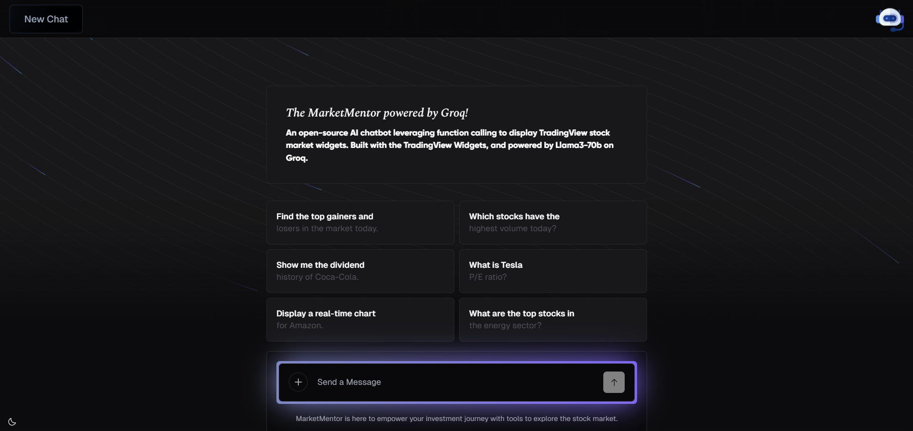
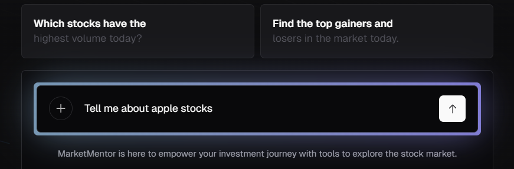
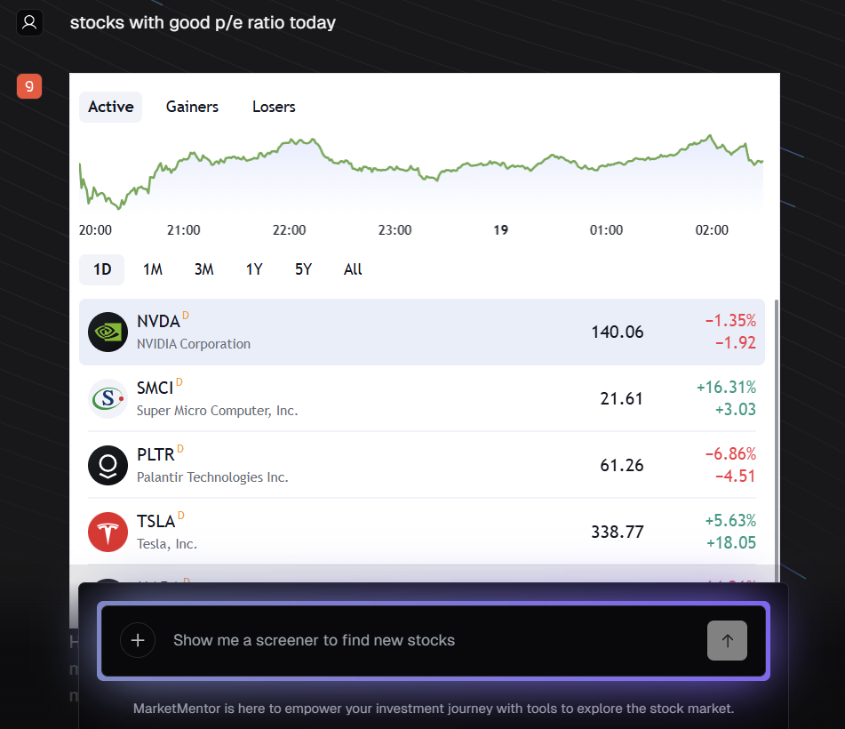
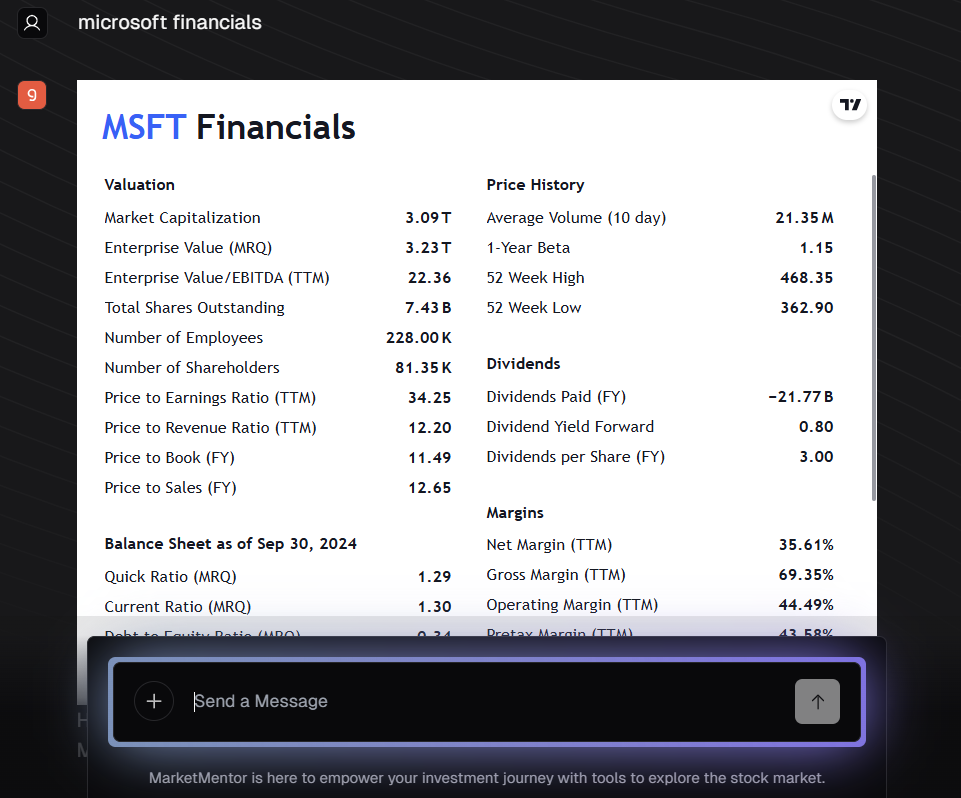
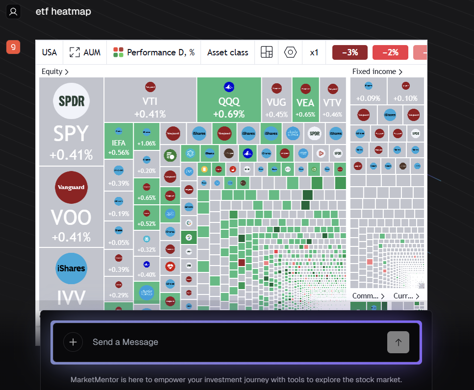

# 📈 Market Mentor Powered by Groq

An AI-powered financial assistant that delivers real-time market insights through an interactive chatbot interface. The platform combines advanced AI models, live financial visualization, and voice-based interaction to simplify access to complex financial data.

> Developed as a Minor Project at Jaypee Institute of Information Technology, Noida. :contentReference[oaicite:0]{index=0}

---



## 🚀 Features

- 🤖 AI-powered chatbot for financial queries
- 🎙️ Voice-based query input using speech-to-text

- 📊 Real-time interactive stock charts with TradingView
- 💹 Multi-asset market support
  - Stocks
  - Forex
  - Bonds
  - Cryptocurrencies
  
- 🌗 Light/Dark theme support
- ⚡ Fast AI inference with Groq API
- 🧠 Context-aware financial responses with minimal latency

---



## 🛠️ Tech Stack

### Frontend
- React
- Next.js
- TypeScript
- Tailwind CSS



### Backend
- Groq API
- Llama3-70B
- Secure API Integrations

### Tools & Technologies
- TradingView
- JMeter

---

## 🧠 Project Workflow

1. User enters query through chat or voice input
2. Query is processed using Llama3-70B via Groq API
3. Real-time financial data is fetched from TradingView
4. AI generates contextual insights and responses
5. Results are dynamically displayed on the frontend

---

## 📷 Key Functionalities

### 📌 AI Financial Assistant
Provides intelligent responses to financial and market-related queries in real time.

### 📌 Voice Query Support
Users can interact using voice commands with speech-to-text conversion.

### 📌 Live Market Visualization
Interactive charts powered by TradingView for market analysis.

### 📌 Responsive UI
Modern and fully responsive interface built using React, Next.js, and Tailwind CSS.

---

## ⚙️ Installation

### Clone the repository

```bash
git clone <your-repository-url>
cd market-mentor